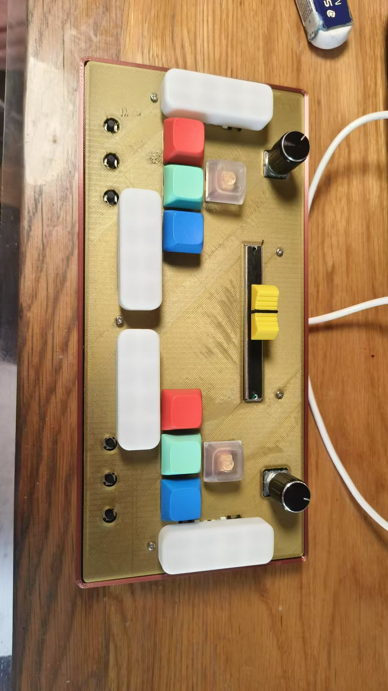

# Introduction

Rhythkey is a versatile music game controller which use Keyboard Simulation and mouse simulation. The controllor used in this project is arduino pro micro.
This controller consist 12 keys (recommand: 8 1U sized keys and 2 2.75U sized side-keys), 6 switches, 2 encoders and 1 potentiometers.

All key switches and encoder can be programmed to be uses as one character output within ASCII II. Additionally, the potentiometer and encoders can be programmed to
control the mouse movement.

This controllor is designed for play multiple music games, for example: **Ongeki, Sound Voltex, DJMAX, Muse Dash, Musynx, Osu!mania, Osu!, Osu!taiko, Osu!catch...**

# Structure
This game controllor is construct from following conponents:
* 3D printed top cover plate ("board_up.STL" in rhythkeyV1_CAD folder)
* 3D printed bottom plate ("board_bottom.STL" in rhythkeyV1_CAD folder)
* PCB board ("RhythkeyV1_Gerber.zip")
* Sparkfun Arduino Pro Micro (https://www.sparkfun.com/pro-micro-3-3v-8mhz.html)
* 12 mechanical key_Switches
* 8 1U sized keycaps and 4 2.75U keycaps
* 2 Incremental Encoders (with 2 knobs)
* 1 B10K Slide Potentiometer (with knob)
* 2 N.O.(Normally Open) Pushbutton Switches (with knobs)
* 4 Satellite Axis for 2.75 U keys.
* 6 M2x8 Self-tapping screw
* 5 M2x16 Self-tapping screw

# How to build this project?
under construction...
