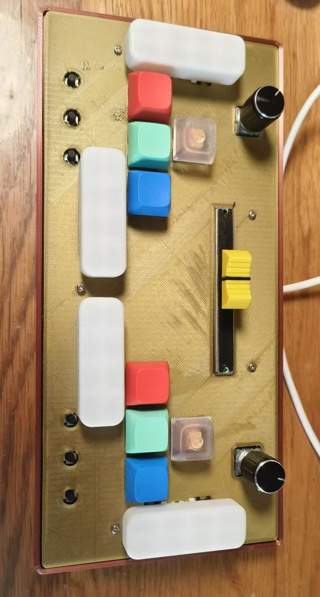
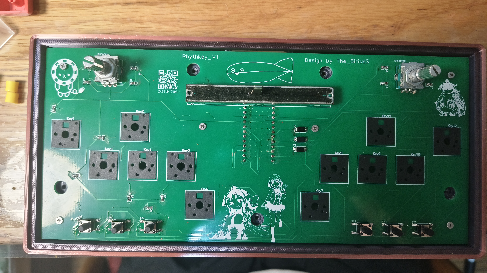
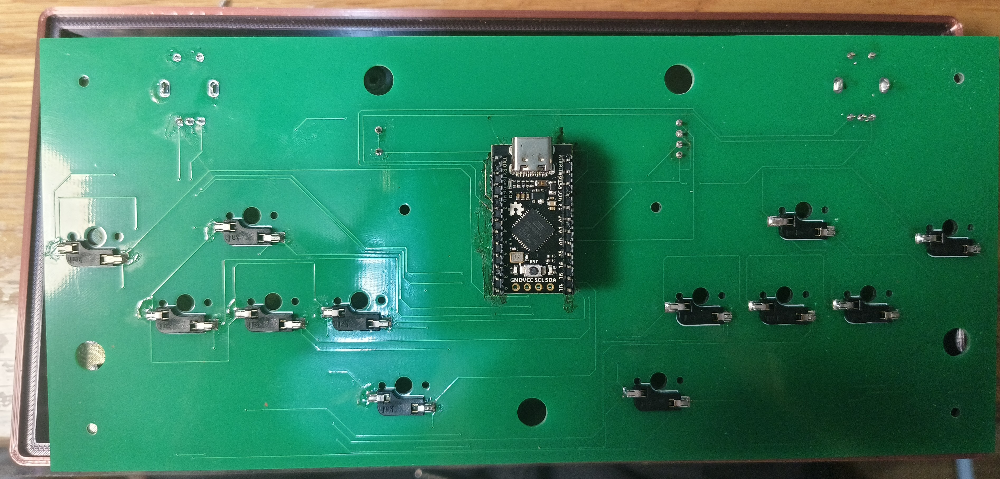
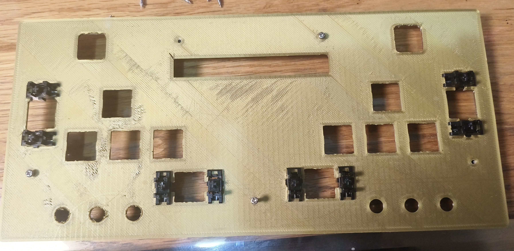
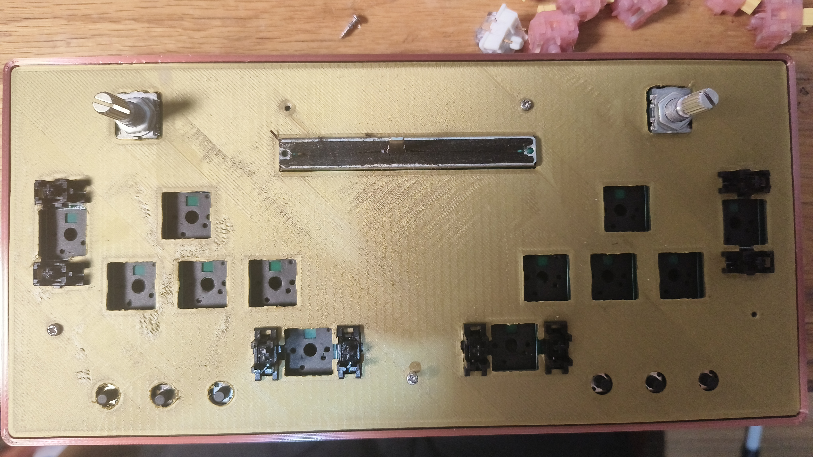
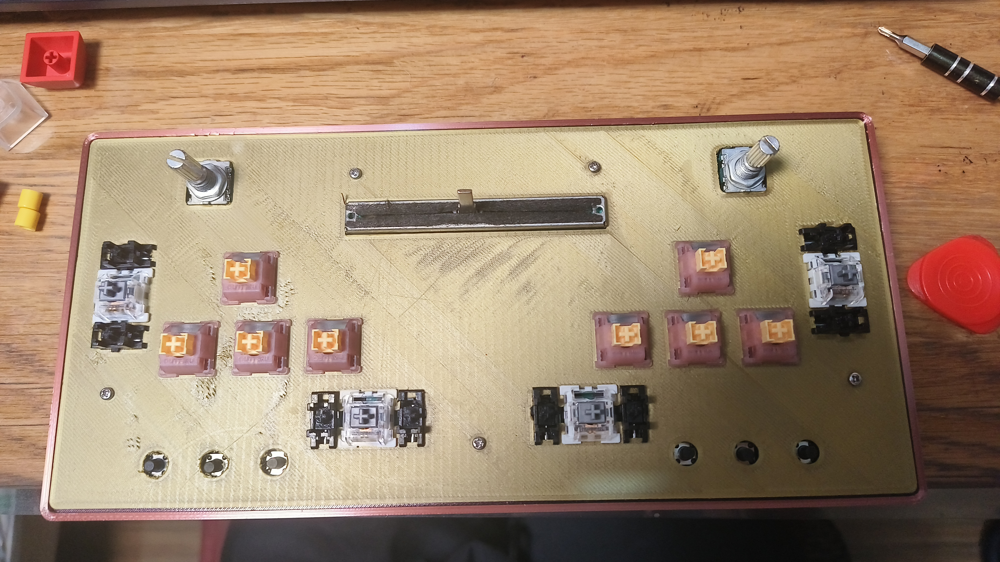
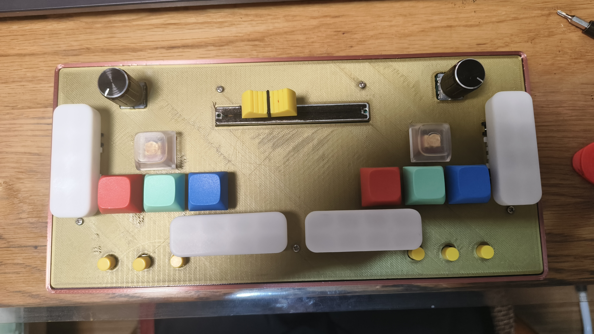

# Introduction

Rhythkey is a versatile music game controller which use Keyboard Simulation and mouse simulation. The controllor used in this project is arduino pro micro.
This controller consist 12 keys (recommand: 8 1U sized keys and 2 2.75U sized side-keys), 6 switches, 2 encoders and 1 potentiometers.

All key switches and encoder can be programmed to be uses as one character output within ASCII II. Additionally, the potentiometer and encoders can be programmed to
control the mouse movement.

This controllor is designed for play multiple music games, for example: **Ongeki, Sound Voltex, DJMAX, Muse Dash, Musynx, Osu!mania, Osu!, Osu!taiko, Osu!catch, 	Hatsune Miku: Project Diva...**

# Structure
This game controllor is construct from following conponents:
main part:
* 1x 3D printed top cover plate ("board_up.STL" in rhythkeyV1_CAD folder)
* 1x 3D printed bottom plate ("board_bottom.STL" in rhythkeyV1_CAD folder)
* 1x PCB board ("RhythkeyV1_Gerber.zip")
* 1x Sparkfun Arduino Pro Micro (https://www.sparkfun.com/pro-micro-3-3v-8mhz.html)
* 12x mechanical key_Switches
* 12x hotswap Socket Kailh for hotswap keyboard
* 8x 1U sized keycaps and 4 2.75U keycaps
* 4x Satellite Axis for 2.75 U keys.

electronics:
* 2x Incremental Encoders (EC11E09244BS) (with 2 knobs)
* 1x B10K 75mm Slide Potentiometer (with knob)
* 6x N.O.(Normally Open) Pushbutton Switches (with knobs)
* 10x R0805 10K ohm resistors
* 4x R0805 100nF capacitors
* 3x SMA_1N4007 diode
* 2x 2.54mm Pitch (1x12) Female Headers

other mechanical parts:
* 6x M2x8 Self-tapping screw
* 5x M2x16 Self-tapping screw

# How to build this project?
step 1: preparing the material
* download the STL files of the 3D printed board, and print them
* download the Gerber file of PCB, and contact a PCB factory for manufacturing.

step 2: soldering
* for this step, you need a soldering set to proceed.
* for the PCB schematic, please refer to rhythkeyV1_Schematic.pdf
* top layer:
  * resistors R1 - R10
  * capacitor C1 - C4
  * Diode D1 - D3
  * Slide Potentiometer
  * Incremental Encoders
  * Pushbutton Switches
* bottom layer:
  * hotswap Socket Kailh for hotswap keyboard
  * Female Headers
 * after soldering, your PCB board should looks like this:
   
   
   
Step 3: Assembly
 1. After soldering, fix the PCB on the bottom plate with 6 M2x8 Self-tapping screws
 2. Put Satellite Axis into the slot of top plate.
    
 3. Fix the top plate with 5 M2x16 Self-tapping screws
    
 4. Insert 12 mechanical key_Switches in the slot of top plate.
    
 5. Put the keycaps and knobs on corresponding parts.
    
